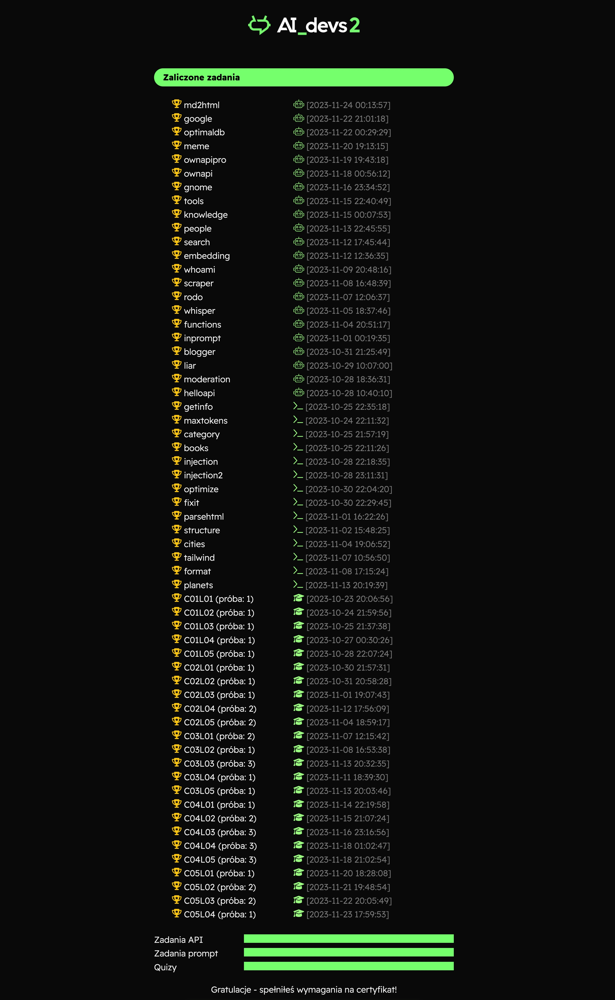
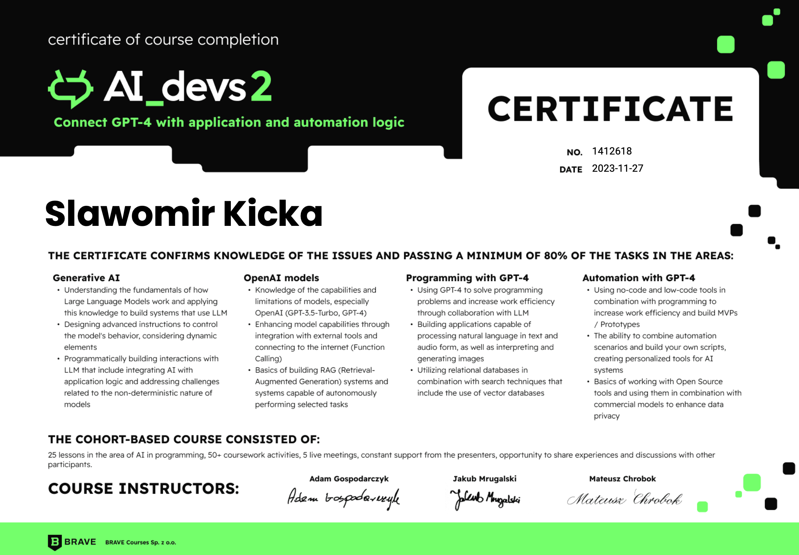

# AIDevs2
A practical course focused on integrating Generative AI tools, especially OpenAI LLM models, with application logic and automation tools.

## Important
Be aware that the code in this repository is designed specifically for the AIDevs2 course. It's optimized for use alongside the course's materials and guidance. Without these, the code might not be completely comprehensible or operational.

## Assignments
I've been tackling assignments on the AIDevs2. The first type of assignments were prompt engineering related, and I've conveyed my solutions through screenshots. The second type involves coding tasks. For these, I've implemented my solutions using Python and also on MAKE.COM, a no-code platform.

## Results
I've done all the assignments in the course and received a certificate of completion.

## Certificate
